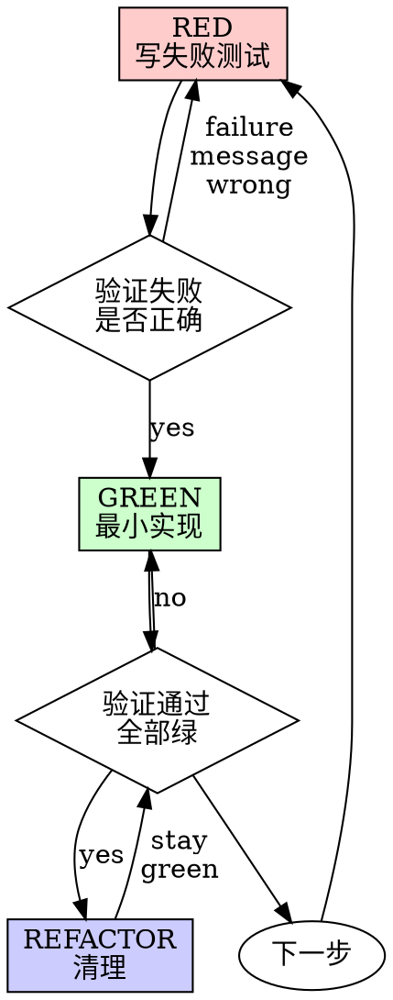

# Brainstorm - 需求发现与设计（AI 增强）

在实现之前引导 AI 进行协作式需求发现，结合结构化头脑风暴与清晰设计：

* **任务优先**（立即在 PRD 中捕获想法）
* **行动先于提问**（减少低价值问题）
* **研究优先**（技术选型时，避免让用户凭空想象选项）
* **发散 → 收敛**（扩展思考，然后锁定 MVP）
* **隔离设计**（组件边界清晰，接口明确）

---

## 何时使用

当用户描述开发任务时，从 `/trellis:start` 触发，尤其是：

* 需求不清晰或不断演变
* 有多条可行的实现路径
* 权衡很重要（用户体验、可靠性、可维护性、成本、性能）
* 用户可能事先不知道最佳方案

<HARD-GATE>
在未展示设计并获得用户批准之前，**禁止**调用任何实现技能、编写任何代码、搭建任何项目或采取任何实现行动。适用于所有项目，无论感知多么简单。
</HARD-GATE>

**反模式："这太简单了，不需要设计"**

每个项目都要经过这个流程。任务列表、单函数工具、配置变更——都是如此。"简单"项目往往是不经审视的假设造成最多浪费的地方。设计可以很短（真正简单的项目几句话即可），但你**必须**展示并获得批准。

---

## 核心原则（不可妥协）

1. **任务优先（尽早捕获）**
   始终确保在开始时就创建任务，以便立即记录用户的想法。

2. **行动先于提问**
   如果能从代码库、文档、配置、惯例或快速调研中得出答案——先做再问。

3. **一次只问一个问题**
   不要用一连串问题压垮用户。问一个，更新 PRD，重复。

4. **首选具体选项**
   对于偏好/决策问题，提供 2-3 个可行、具体的方案及权衡。

5. **技术选型研究优先**
   如果决策取决于行业惯例/类似工具/成熟模式，先研究再提方案。

6. **发散 → 收敛**
   初步理解后，主动拓宽思考（未来演化、相关场景、失败/边缘案例），然后收敛到明确的 MVP 范围。

7. **隔离与清晰设计**
   将系统拆分为更小的单元，每个单元有单一明确的目的，通过定义清晰的接口通信，可以独立理解和测试。

8. **不问元问题**
   不要问"我应该搜索吗？"或"你能粘贴代码让我继续吗？"
   需要信息：搜索/检查。被阻塞：问最小阻塞问题。

---

## Step 0: 确保任务存在（始终执行）

在任何问答之前，确保任务已存在。如果没有，立即创建一个。

* 使用从用户消息派生的**临时工作标题**。
* 标题不完美没关系——后续可以在 PRD 中优化。

```bash
TASK_DIR=$(python3 ./.trellis/scripts/task.py create "brainstorm: <简短目标>" --slug <自动>)
```

立即用已知信息创建/填充 `prd.md`：

```markdown
# brainstorm: <简短目标>

## 目标

<一段话：做什么 + 为什么>

## 我已知的信息

* <来自用户消息的事实>
* <从代码库/文档发现的事实>

## 假设（临时的）

* <待验证的假设>

## 待解决问题

* <仅阻塞性/偏好问题；保持列表简短>

## 需求（演进中）

* <从已知内容开始>

## 验收标准（演进中）

* [ ] <可测试的标准>

## 完成定义（团队质量基准）

* 测试已添加/更新（适当的首位/集成测试）
* Lint / 类型检查 / CI 通过
* 行为变更时更新文档/笔记
* 已考虑发布/回滚风险

## 范围外（明确）

* <本次不会做的事>

## 技术笔记

* <检查的文件、约束、链接、参考>
* <研究笔记摘要（如适用）>
```

---

## Step 1: 自动收集上下文（提问前执行）

在问"代码长什么样？"之前，自己收集上下文：

### 代码库检查清单

* 识别可能影响的模块/文件
* 定位现有模式（类似功能、惯例、错误处理风格）
* 检查配置、脚本、现有命令定义
* 记录约束（运行时、依赖策略、构建工具）

### 文档检查清单

* 查找现有 PRD/规格/模板
* 查找命令用法示例、README、ADR（如果存在）

将发现写入 PRD：

* 添加到"我已知的信息"
* 添加约束/链接到"技术笔记"

---

## Step 2: 复杂度分类（影响深度）

| 复杂度 | 标准 | 行动 |
|--------|------|------|
| **Trivial（微调）** | 单行修复、拼写错误、明显变更 | 跳过头脑风暴，直接实现 |
| **Simple（简单）** | 目标清晰、1-2 个文件、范围明确 | 问一个确认问题，然后实现 |
| **Moderate（适中）** | 多个文件、一些歧义 | 轻度头脑风暴（2-3 个高价值问题） |
| **Complex（复杂）** | 目标模糊、架构选择、多条路径 | 完整头脑风暴 |

> 注意：任务已从 Step 0 创建。分类仅影响头脑风暴的深度。

---

## Step 3: 提供视觉伴侣（如适用）

当预见到接下来的问题涉及视觉内容（mockups、布局、图表、架构比较）时，提供视觉伴侣：

> "我们正在做的一些内容如果能在网页浏览器中展示给你，可能更容易解释。我可以随进度整理 mockups、图表、比较和其他视觉内容。想试试吗？"

**此提议必须是一条独立消息。** 不要与澄清问题、上下文摘要或任何其他内容合并。等待用户回复后再继续。如果用户拒绝，继续纯文本头脑风暴。

**每个问题决策：** 即使用户同意，也要为每个问题决定是否使用浏览器或终端：

- **使用浏览器**适用于视觉内容——mockups、线框图、布局比较、架构图表、并排视觉设计
- **使用终端**适用于文本内容——需求问题、概念选择、权衡列表、A/B/C/D 文本选项、范围决策

关于 UI 主题的问题不自动是视觉问题。"在这个上下文中，个性意味着什么？"是概念问题——用终端。"哪个向导布局更好？"是视觉问题——用浏览器。

---

## Step 4: 问题 Gate（仅问高价值问题）

在提问之前，运行以下 gate：

### Gate A — 我能不问用户自己得出答案吗？

如果答案可通过以下方式获得：

* 代码库检查（代码/配置）
* 文档/规格/惯例
* 快速市场/开源研究

→ **不要问。** 获取它，总结，更新 PRD。

### Gate B — 这是元问题/懒问题吗？

示例：

* "我应该搜索吗？"
* "你能粘贴代码让我继续吗？"
* "代码长什么样？"（当代码库可访问时）

→ **不要问。** 采取行动。

### Gate C — 这是什么问题类型？

* **阻塞性**：没有用户输入无法继续
* **偏好性**：多个有效选项，取决于产品/用户体验/风险偏好
* **可推导**：应通过检查/研究回答

→ 仅问**阻塞性**或**偏好性**问题。

---

## Step 5: 研究优先模式（技术选型必需）

### 触发条件（满足任一 → 研究优先）

* 任务涉及选择方案、库、协议、框架、模板系统、插件机制或 CLI UX 惯例
* 用户问"最佳实践"、"别人怎么做"、"推荐什么"
* 用户无法合理地列举选项

### 研究步骤

1. 识别 2-4 个可比较的工具/模式
2. 总结常见惯例及其原因
3. 将惯例映射到我们的代码库约束
4. 提出**2-3 个可行方案**

### 研究输出格式（写入 PRD）

在 PRD 中添加一个 section：

```markdown
## 研究笔记

### 类似工具的做法

* ...
* ...

### 我们代码库/项目的约束

* ...

### 这里可行的方案

**方案 A: <名称>**（推荐）

* 如何工作：
* 优点：
* 缺点：

**方案 B: <名称>**

* 如何工作：
* 优点：
* 缺点：

**方案 C: <名称>**（可选）

* ...
```

然后问**一个**偏好问题：

* "你倾向于哪个方案：A / B / C（或其他）？"

---

## Step 6: 扩展思考（发散）— 初步理解后必需

当你能够总结目标时，主动拓宽思考再收敛。

### 扩展类别（每项保持 1-2 条）

1. **未来演化**

   * 这个功能在 1-3 个月内可能变成什么？
   * 现在值得保留哪些扩展点？

2. **相关场景**

   * 哪些相邻命令/流程应与这个保持一致？
   * 是否有对称性期望（create vs update, import vs export 等）？

3. **失败与边缘案例**

   * 冲突、离线/网络故障、重试、幂等性、兼容性、回滚
   * 输入验证、安全边界、权限检查

### 扩展消息模板

```markdown
我理解你想要实现：<当前目标>。

在深入设计之前，让我快速发散思考三个类别（避免后续返工）：

1. 未来演化：<1-2 条>
2. 相关场景：<1-2 条>
3. 失败/边缘案例：<1-2 条>

对于这个 MVP，你想包含哪个（或都不）？

1. 仅当前需求（最小可行）
2. 添加 <X>（保留给未来扩展）
3. 添加 <Y>（提高健壮性/一致性）
4. 其他：描述你的偏好
```

然后更新 PRD：

* MVP 中的内容 → `需求`
* 排除的内容 → `范围外`

---

## Step 7: 问答循环（收敛）

### 规则

* 一次只问一个问题
* 尽可能用多选题
* 每次用户回答后：

  * 立即更新 PRD
  * 将回答的问题从"待解决问题"移到"需求"
  * 用可测试的复选框更新"验收标准"
  * 明确"范围外"

### 问题优先级（推荐）

1. **MVP 范围边界**（包含什么/不包含什么）
2. **偏好决策**（呈现具体选项后）
3. **失败/边缘行为**（仅 MVP 关键路径）
4. **成功指标与验收标准**（什么证明它有效）

### 首选问题格式（多选题）

```markdown
对于 <主题>，你倾向于哪个方案？

1. **方案 A** — <含义 + 权衡>
2. **方案 B** — <含义 + 权衡>
3. **方案 C** — <含义 + 权衡>
4. **其他** — 描述你的偏好
```

---

## Step 8: 提出方案 + 记录决策（复杂任务）

当需求足够清晰时，提出 2-3 个方案（如尚未通过研究完成）：

```markdown
根据当前信息，这里有 2-3 个可行方案：

**方案 A: <名称>**（推荐）

* 如何：
* 优点：
* 缺点：

**方案 B: <名称>**

* 如何：
* 优点：
* 缺点：

你倾向于哪个方向？
```

在 PRD 中将结果记录为 ADR-lite：

```markdown
## 决策（ADR-lite）

**背景**：为什么需要这个决策
**决策**：选择了哪个方案
**后果**：权衡、风险、潜在改进
```

---

## Step 9: 展示设计

当你相信自己已经理解要构建什么时，展示设计：

### 设计原则

1. **拆分为边界清晰的单元**
   - 每个单元有单一明确的目的
   - 通过定义清晰的接口通信
   - 可以独立理解和测试

2. **对于每个单元，你应该能够回答：**
   - 它做什么？
   - 你如何使用它？
   - 它依赖什么？

3. **按复杂度缩放：**
   - 直接则几句话
   - 复杂则多达 200-300 字

### 设计章节（按需覆盖）

- **架构**：高层结构和组件关系
- **组件**：关键单元及其职责
- **数据流**：数据如何在系统中流转
- **错误处理**：如何捕获和报告失败
- **测试**：如何验证正确性

### 增量展示

每个章节后问"到目前为止看起来对吗？"如果有问题，准备好回头澄清。

---

## Step 10: 写设计文档 + 自审

### 写入 PRD

用完整设计更新 PRD：

```markdown
## 设计

### 架构
<描述>

### 组件
<单元 1>: <职责>
<单元 2>: <职责>

### 数据流
<描述>

### 错误处理
<描述>

### 测试
<如何验证>
```

### Spec 自审（内联）

写完后，用新眼光审视：

1. **占位符扫描：** 有任何"TBD"、"TODO"、不完整章节或模糊需求吗？修复它们。
2. **内部一致性：** 章节之间有矛盾吗？架构与功能描述匹配吗？
3. **范围检查：** 范围是否足够集中于单一实现计划，还是需要分解？
4. **歧义检查：** 需求能被两种不同方式解释吗？如果是，选择一个并明确。

内联修复问题。不需要重新审查——修复后继续。

---

## Step 11: 用户审核 Gate

Spec 审查循环通过后，请用户在继续之前审核书面 PRD：

> "设计已写入 `<task-dir>/prd.md`。请审核，如果你想做任何修改，在我开始写实现计划之前告诉我。"

等待用户回复。如果用户要求更改，进行修改并重新运行 spec 审查循环。只有获得用户批准后才能继续。

---

## Step 12: 最终确认 + 转向实现

设计获得批准后，用结构化摘要确认：

```markdown
以下是我对完整需求的理解：

**目标**：<一句话>

**设计**：
- 架构：<简要>
- 组件：<列表>

**需求**：

* ...

**验收标准**：

* [ ] ...

**完成定义**：

* ...

**范围外**：

* ...

**后续步骤**：

设计批准后，我将在 PRD 中补充 `## 实现计划` section，包含每个组件的详细实现步骤（微步骤 + 实际代码）。

这看起来正确吗？如果是，我将进入实现阶段。
```

获得批准后，进入 Task Workflow Phase 2。根据 PRD 中的设计章节，在 PRD 内部补充 `## 实现计划` section（见下方结构），细化每个组件的实现步骤。

---

## PRD 目标结构（最终）

`prd.md` 应收敛到：

```markdown
# <任务标题>

## 目标

<为什么 + 做什么>

## 需求

* ...

## 验收标准

* [ ] ...

## 完成定义

* ...

## 设计

### 架构
<描述>

### 组件
<单元>: <职责>

### 数据流
<描述>

## 决策（ADR-lite）

背景 / 决策 / 后果

## 实现计划

> 当设计批准后，在此章节展开详细的实现步骤。
> 采用 TDD（测试驱动开发）流程：先写失败测试，再写最小实现。
> 每个步骤应：包含实际代码/命令、无占位符、按 2-5 分钟微步骤拆分。

### TDD 铁律

```
无失败测试，不得写生产代码
```

在写任何实现代码之前，必须先写一个失败测试。
如果测试直接通过，说明你在测试已有行为，而非新功能。

### RED-GREEN-REFACTOR 循环



### 好测试 vs 坏测试

| 质量 | 好 | 坏 |
|------|-----|-----|
| **最小** | 一件事。名字有"and"？拆开。 | `test('validates email and domain and whitespace')` |
| **清晰** | 名字描述行为 | `test('test1')` |
| **展示意图** | 展示期望的 API | 掩盖代码应该做什么 |

### Task N: <组件名称>

**涉及文件：**
- 创建：`exact/path/to/file.py`
- 修改：`exact/path/to/existing.py:123-145`
- 测试：`tests/exact/path/to/test.py`

#### RED - 写失败测试

- [ ] **Step 1: 写一个失败的测试**

```python
def test_specific_behavior():
    """描述期望行为的测试"""
    result = function(input)
    assert result == expected
```

测试要求：
- 一条行为
- 清晰的名字
- 真实代码（除非不可避免否则不用 mock）

#### 验证 RED - 看它失败

- [ ] **Step 2: 运行测试确认失败**

运行：`pytest tests/path/test.py::test_name -v`

确认：
- 测试失败（不是错误）
- 失败信息符合预期
- 因为功能缺失而失败（不是拼写错误）

**测试通过了？** 你在测试已有行为。修复测试。
**测试错误？** 修复错误，重新运行直到正确失败。

#### GREEN - 最小实现

- [ ] **Step 3: 写最小实现**

```python
def function(input):
    return expected
```

只写通过测试所需的最少代码。不要添加功能、不要重构其他代码、不要"改进"。

#### 验证 GREEN - 看它通过

- [ ] **Step 4: 运行测试确认通过**

运行：`pytest tests/path/test.py::test_name -v`

确认：
- 测试通过
- 其他测试仍然通过
- 输出干净（无错误、警告）

**测试失败？** 修复代码，不是测试。
**其他测试失败？** 立即修复。

#### REFACTOR - 清理

- [ ] **Step 5: 重构（可选，如需要）**

在 green 之后：
- 移除重复
- 改进名字
- 提取辅助函数

保持测试绿。不要添加行为。

#### 提交

- [ ] **Step 6: 提交**

```bash
git add tests/path/test.py src/path/file.py
git commit -m "feat: add specific feature"
```

### TDD 验证检查清单

完成前检查：

- [ ] 每个新函数/方法都有测试
- [ ] 实现前看了每个测试失败
- [ ] 每个测试因预期原因失败（功能缺失，非拼写错误）
- [ ] 写了最小代码通过每个测试
- [ ] 所有测试通过
- [ ] 输出干净（无错误、警告）
- [ ] 测试使用真实代码（mock 仅在不可避免时使用）
- [ ] 覆盖了边缘案例和错误

不能全部勾选？你跳过了 TDD。重来。

### 常见辩解

| 借口 | 现实 |
|------|------|
| "太简单不需要测试" | 简单代码也会坏。测试只需 30 秒。 |
| "之后测试" | 测试立即通过什么都证明不了。 |
| "之后测试达到同样目标" | 之后测试 = "这做什么？" 先测试 = "这应该做什么？" |
| "已经手动测试了" | 临时 ≠ 系统。无记录，无法重跑。 |
| "删除 X 小时浪费" | 沉没成本谬误。保留未验证代码是技术债。 |

（重复上述结构直到所有组件完成）

## 范围外

* ...

## 技术笔记

<约束、参考、文件、研究笔记>
```

### PRD 与实现计划的关系

| 文档 | 层级 | 问题 | 读者 |
|------|------|------|------|
| **PRD** | 高层 | "做什么 + 为什么" | AI + 用户共读 |
| **实现计划** | 细节 | "每一步怎么做" | AI 独立执行 |

实现计划直接输出到 PRD 的 `## 实现计划` section，保持单一信息源，避免两个文档同步维护的负担。

---

## 反模式（硬性避免）

* 问用户能自己从代码库推导的问题
* 在呈现具体选项之前让用户选择方案
* 问是否应该研究的元问题
* 局限在初始请求而不考虑演化/边缘
* 头脑风暴漂移而不更新 PRD
* "这太简单不需要设计"——所有项目都要经过这个流程
* 跳过用户审核 gate 直接进入实现

---

## 与 Start Workflow 的集成

头脑风暴完成后（Step 12 确认批准），流程继续：

```text
Brainstorm
  Step 0: 创建任务目录 + 填充 PRD
  Step 1-8: 发现需求、研究、收敛
  Step 9: 展示设计
  Step 10: 写设计文档 + 自审
  Step 11: 用户审核 gate → 用户批准
  Step 12: 最终确认 → PRD 中补充 ## 实现计划
  ↓
Task Workflow Phase 2/3（执行）
  基于 PRD（包括 ## 实现计划）执行
  → 如需要，补充代码规格上下文
  → 实现 → 检查 → 完成
```

**关键改进**：实现计划直接写入 PRD 的 `## 实现计划` section，保持单一信息源，不再维护独立 plan 文件。

任务目录和 PRD 已从头脑风暴存在，因此完全跳过 Task Workflow 的 Phase 1。

---

## 相关命令

| 命令 | 何时使用 |
|------|----------|
| `/trellis:start` | 触发头脑风暴的入口 |
| `/trellis:finish-work` | 实现完成后 |
| `/trellis:update-spec` | 工作期间出现新模式时 |